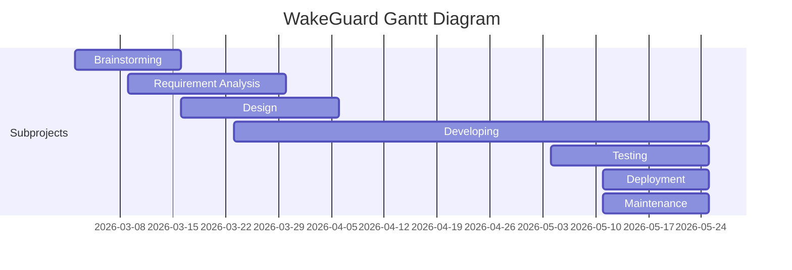

<h1 align="center">
  🚗 WakeGuard
</h1>

## ❓ Tentang 
WakeGuard adalah aplikasi untuk deteksi kantuk pada pengemudi dengan tujuan meminimalkan risiko kecelakaan karena microsleep

## 🎯 Tujuan 
- Mencegah terjadinya kecelakaan lalu lintas yang disebabkan oleh microsleep yang dialami oleh pengendara
- Membantu user dalam kewaspadaan mengendarai kendaraan 
- Memberikan peringatan kepada pengguna kendaraan yang mengantuk.

## 👤 Pengguna Potensial
Pengguna potensial dari produk adalah Pengemudi kendaraan  roda 4 seperti Mobil, Truk, dll dan Pengemudi kendaraan  roda 2.
Kebutuhan pengguna : 
- Fitur yang tepat. Pengguna ingin fitur yang ada pada aplikasi dapat menjadi solusi ketika mengalami microsleep.
- Keakuratan. Pengguna ingin aplikasi dapat dengan akurat mendeteksi tanda-tanda mengantuk berdasarkan facial expression dan memberikan peringatan tepat waktu.
- Kemudahan penggunaan. Pengguna ingin aplikasi mudah untuk digunakan dan tidak mengganggu saat berkendara. Aplikasi harus memiliki interface yang sederhana dan mudah dimengerti.
- Kompatibilitas. Pengguna ingin aplikasi kompatibel sehingga dapat dipasang di berbagai perangkat sehingga aplikasi dapat diakses dan mudah digunakan tanpa adanya masalah teknis.
- Keamanan dan privasi. Pengguna ingin data pribadi mereka terlindungi dengan baik dan aman sehingga tidak terjadinya penggunaan atau pencurian data.

## 🧾 Diagram
### Usecase Diagram

### Entity Relationship Diagram

## ⚙ Functional Requirements
| FR  | Diagram |
| ------------- | ------------- |
| FR1  | Pengemudi dapat terdeteksi kantuk dengan facial expression mata dan mulut  |
| FR2  | Pengemudi diberikan peringatan agar tetap aware terhadap jalan, yang nantinya akan terbagi menjadi beberapa fitur alert untuk fase-fase tertentu.  |
| FR3  | Pengemudi akan diberikan rekomendasi terkait tips-tips berkendara agar tetap fokus.  |
| FR4  | Pengemudi diberikan akses komunikasi yang cepat, jika sewaktu-waktu kecelakaan terjadi. Seperti nomor-nomor penting, termasuk Polisi, Ambulans, dan lainnya sebagai pertolongan pertama.  |

## 🖼 Wireframing
- [Lo-Fi Wireframing](https://www.figma.com/file/aV7ggJ6RH2coW8szDVTk1L/WakeGuard---Wireframe?node-id=0%3A1&t=a3xpXmo7uHITH5mQ-1 )
- [Hi-Fi Wireframing](https://www.figma.com/file/aV7ggJ6RH2coW8szDVTk1L/WakeGuard---Wireframe?node-id=20%3A92&t=a3xpXmo7uHITH5mQ-0)

## 📅 Gantt Chart

## 🔁 Software Development Life Cycle
### Method
Agile: Kanban

### Mengapa Kanban?
- Tidak ada pembagian role khusus dalam proyek pengembangan sehingga memudahkan SDLC
- Efisiensi waktu proses pengembangan
- Terpetakan secara visual sehingga mudah dipahami

## 👨‍💻 Kelompok Pancasila 
- Christina Angraeni Panellah - 20/456840/TK/50664 **(Ketua Kelompok)**
- Saddan Syah Akbar - 20/460566/TK/51155
- Agnes Suarna - 463589/TK/51581

